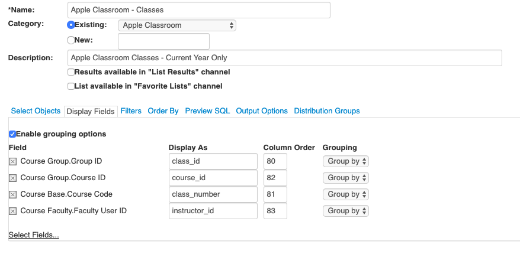
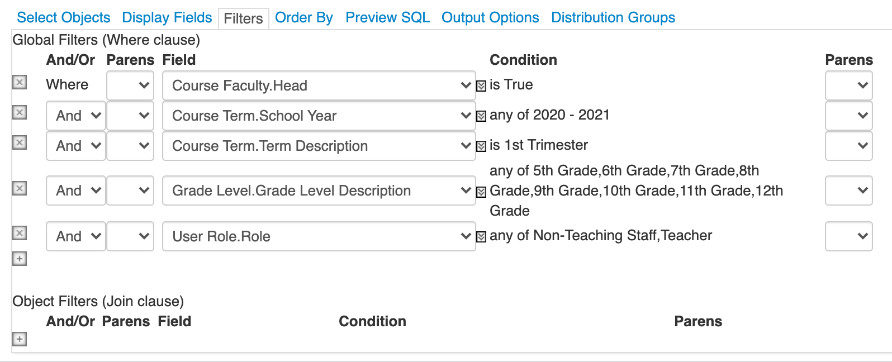
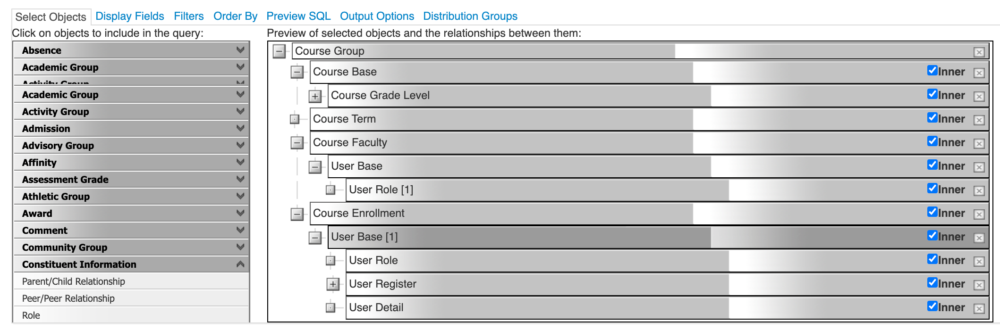

**BB2ASM**

This script will import students, staff, classes, and rosters from
Blackbaud SIS (onRecord) into Apple School Manager. Once configured, it
can be run automatically from cron or Windows Task scheduler.

Use at your own risk\!

There are a number of steps necessary to successfully configure and run
the script.

  - > Create Advanced Lists in Blackbaud for Students, Staff, Courses,
    > Classes, and Rosters

  - > Add BB2ASM Application to My Applications

  - > Install Script Prerequisites

  - > Configure Script

  - > Authorize and Run the Script

**Create Advanced Lists in Blackbaud for Students, Staff, Courses,
Classes, and Rosters**

Login to the Blackbaud SIS. From the Core section choose Analysis -
Manage Lists. Click Manage Basic and Advanced Lists.

Create the following Advanced Lists using the following settings Note,
these lists are configured specifically to work with Colorado Academy’s
Blackbaud system. It should work with most systems, but you may need to
make changes based on your exact Blackbaud configuration.

**Students**

Note: The User Base.E-Mail should match the domain name you are using
for Apple IDs.

**Staff**

Note: We are excluding users who end in Academy or Mustang because these
are test users in our system. We require all staff to have a
coloradoacademy.org email address so their Apple IDs are created
properly.

**Courses**

Note: School Year and Term Description should be set appropriately. The
Course Grade Level.Grade Id corresponds to grades 5th through 12th in
our system. You will need to determine the correct IDs for your
configuration.

**Classes**

Note: School Year and Term Description should be set appropriately. The
Course Grade Level.Grade Id corresponds to grades 5th through 12th in
our system. You will need to determine the correct IDs for your
configuration.

**Rosters**

Note: School Year and Term Description should be set appropriately. The
Course Grade Level.Grade Id corresponds to grades 5th through 12th in
our system. You will need to determine the correct IDs for your
configuration. All of our users are required to have coloradoacademy.org
email addresses.

**Add BB2ASM Application to My Applications**

If you do not already have a Blackbaud Developer account sign up at:

[https://developer.blackbaud.com/skyapi/](https://developer.blackbaud.com/skyapi/)

When logged into the Developer portal choose Developer Account - My
Applications. Click the Add Button to register a new application and
fill in the following information.

Application Name: Blackbaud to Apple School Manager

Application Details: Send Blackbaud Rosters to ASM

Organization Name: Your School

Application Web Site URL: github.com/jared/bb2asm/

Redirect URIs: https://127.0.0.1

**Install Script Prerequisites**

The script requires Python 3.7+. In addition, you will need the Paramiko
SSH module. In many cases, you can install Paramiko using the following
command:

*pip3 install paramiko*

For additional details please see the Paramiko web site at
[https://github.com/paramiko/paramiko](https://github.com/paramiko/paramiko).

**Configure Script**

Rename bbconfig.sample.py to bbconfig.py and set the following
configuration options in the script:

CLIENT\_ID = '*your\_blackbaud\_application\_id*' \# application ID

CLIENT\_SECRET = '*your\_blackbaud\_application\_secret*' \# application
secret

SUBSCRIPTION\_KEY = r'*your\_blackbaud\_primary\_access\_key*' \#
primary access key

The CLIENT\_ID, CLIENT\_SECRET, and SUBSCRIPTION\_KEY can all be found
in the Blackbaud Developer portal. Your CLIENT\_ID (Application ID) and
CLIENT\_SECRET (Application Secret) is located in the application you
created in the previous step. In the Blackbaud portal choose Developer
Account - My Applications. On your application click on the … and choose
View Details.

The SUBSCRIPTION\_KEY is your primary (or secondary) access key. In the
Blackbaud portal it is located in Developer Account - My Subscriptions.

Next, you will need to locate the List IDs that you created in the first
steps above. On the Blackbaud web site in Core, choose Analysis - Manage
Lists. Click Manage basic and advanced lists. For each list hover over
the Run link and enter the slid for each list into the script.

If you want the script to automatically send your processed zip file to
Apple School Manager set

*sendtoasm = True*

Otherwise, set

*sendtoasm = False*

If sendtoasm is True also set the asm\_location and asm\_location\_name.
These values can be found in Apple School Manager (school.apple.com)
under Institution - Locations. Choose your SFTP location. For additional
instructions on setting up SFTP see Apple’s documentation at
[https://support.apple.com/en-us/HT207029](https://support.apple.com/en-us/HT207029).

Set the sftp\_dest\_host (SFTP URL), sftp\_dest\_username (Username),
and sftp\_dest\_password (Password) which can be found in Apple School
Manager - Settings - Data Source.

**Authorize and Run the Script**

The first time you run the script use the command:

*python3 bb2asm.py --authorize*

When prompted, copy the URL and paste it in your web browser. Click the
Authorize button and login to Blackbaud. Once you are redirected to a
blank web site look for https://127.0.0.1/?code=**xxxx** in the URL bar
of your web browser. Paste the code into the program.

This will generate the Blackbaud API token and refresh token. In the
future, you may run the script using the following command:

*python3 bb2asm.py*
